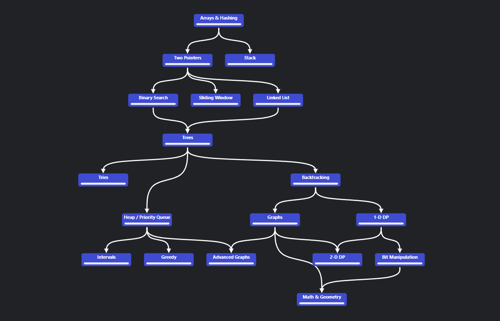

# NeetCode Roadmap in Swift
I plan on following the roadmap available on NeetCode.io, and solve problems on LeetCode daily. 

### Here's how I plan on solving them: 
1. Read the quesiton and understand fully before start coding
2. Write out how I am going to solve the questions
3. Start Coding
   - At first, I will just code to solve the problem
   - At second attempt, I will solve the problem with comments
   - Finally, I will solve the problem with comments, as well as verbally speaking out loud of my thought process.
4. Add random test cases
5. (if applicable) Refactor code and comments
6. Calculate the Big-O for time and space complexity

**Note: Premium questions will be skipped**
